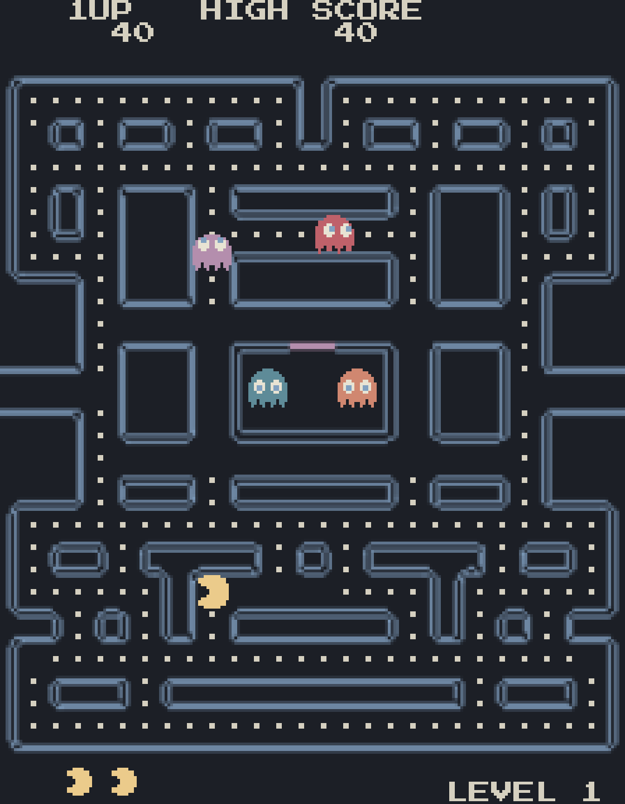

# Pacman for Omarchy

Pac-Man in its own window, drawn in big arcade pixels and coloured from the
live Omarchy theme. It is a standalone Quickshell app (`qs -p app/Main.qml`),
not a bar widget: a quick game to open for a few minutes that looks like it
belongs to the desktop, and recolours itself when the theme changes.



## Keys

| Key | What it does |
|---|---|
| Arrows, `hjkl`, `WASD` | Move |
| Enter or Space | Start from the title; resume when paused |
| `p` or Escape | Pause and resume |
| Escape | On the title: quit |
| `q` | In a game: quit at once (no score is recorded). On the title: hold for a second to quit |
| `g` | Toggle arcade (big pixels) and smooth (full resolution) graphics |
| `m` | Mute and unmute (remembered; MUTE shows in the top-right corner while muted) |
| F12 | Save a frame to `~/.local/state/pacman/frame.png` (only with `PACMAN_DEBUG=1`) |
| Initials screen | Up/down (arrows, `k`/`j`, `w`/`s`) cycles the active slot's letter; right or Enter confirms it (the third confirm saves the row); left steps back a slot; `q` or Escape saves the current letters, then quits |

Any game key ends the attract demo (`g`, `m` and F12 do not). The graphics settings and mute live in
`~/.local/state/pacman/settings.json`; the high-score table is `~/.local/state/pacman/highscore.json`
(a pre-table file with a single score is migrated to the table shape on load).

## High scores

A game over with a qualifying score (top ten, ties keep the older entry ahead of the newer one) goes to
an initials-entry screen instead of straight back to the title: three letters, cycled with up/down and
confirmed one at a time with Enter/right; 30 s of no input saves whatever is showing. The row is written
once, either on the third confirm or on `q`/Escape. **Only a finished game earns a row** — quitting a game
in progress with `q` no longer records a score (a `---` row for every abandoned game would clutter the
table); the attract demo never writes to the table either. The title screen alternates every 5 s between
the roll-call and a HIGH SCORES page listing all ten rows (empty ones shown as `---`); the HUD's
`HIGH SCORE` is always the table's top row.

## Install

The game is tracked as a submodule of the dotfiles repo the way the other
`com.keithrowell.*` plugins are (see the `omarchy-machine-setup` skill). On a
machine that already has the dotfiles:

```bash
cd ~
git submodule update --init .config/omarchy/plugins/com.keithrowell.pacman
~/.config/omarchy/plugins/com.keithrowell.pacman/bin/install
```

Adding it to the dotfiles for the first time:

```bash
cd ~
git submodule add git@github.com:keithrowell/omarchy-plugin-pacman.git .config/omarchy/plugins/com.keithrowell.pacman
# .config/.gitignore is whitelist-style: add the allow rule next to the other
# plugin rules (after the com.keithrowell.reel line), not at the end of the file.
sed -i '/^!omarchy\/plugins\/com\.keithrowell\.reel$/a !omarchy/plugins/com.keithrowell.pacman' .config/.gitignore
git add .gitmodules .config/.gitignore .config/omarchy/plugins/com.keithrowell.pacman
git commit -m "Add Pacman plugin as submodule"
~/.config/omarchy/plugins/com.keithrowell.pacman/bin/install
```

`bin/install` is idempotent (`--dry-run` shows what it would do,
`--uninstall` reverses it). It:

- writes `~/.local/share/applications/Pacman.desktop`, so the app launcher
  lists Pacman with the bundled icon;
- links `~/.local/bin/omarchy-pacman` to `bin/pacman` when `~/.local/bin`
  exists, so the game can be started from a terminal;
- prints, but does not apply, the entry for
  `~/.config/omarchy/extensions/omarchy-menu.jsonc`. Paste it next to the
  other entries and `omarchy-menu` lists Pacman under the `pacman`, `game`
  and `arcade` aliases:

```jsonc
"pacman": {
  "icon": "󰊴",
  "label": "Pacman",
  "description": "Pac-Man in big arcade pixels, coloured from the Omarchy theme",
  "aliases": ["pacman", "game", "arcade"],
  "action": "uwsm-app -- ~/.config/omarchy/plugins/com.keithrowell.pacman/bin/pacman"
}
```

If `uwsm-app` is not installed the installer prints the action as the bare
launcher path instead; the game then runs outside the session's app scope,
which only matters for how it is grouped in `systemctl --user`.

**Never put anything called `pacman` on `PATH`.** That is the Arch package
manager. The launcher in this repo is `bin/pacman` and is only ever run by
its full path (the desktop file and the menu action do that); the PATH
command is `omarchy-pacman`. The installer refuses to run if a `pacman` on
`PATH` resolves into this repo.

Updates: `git pull` inside the submodule, then `bin/install` again (it
reports `unchanged` when nothing moved).

## Theme

Every colour in the game comes from
`~/.local/state/omarchy/current/theme/colors.toml`: the maze, pellets, each
ghost, Pac-Man, the HUD text and the overlays each map to a theme role. The
file is watched, so switching the Omarchy theme recolours the running game.
Nothing is hard-coded, which is why the screenshot above is in whatever
theme was active when it was taken. The only literal colour in the repo is
the yellow of the launcher icon, which the app launcher shows before the game
runs.

## Modes

The game is drawn once, as vectors, in native arcade units (224x288: the
224x248 maze plus the HUD rows). In **arcade** mode that drawing is rendered
to a 224x288 texture and scaled up by a whole number of device pixels with no
filtering, letterboxed, which gives the original hard-edged big-pixel look at
any window size, with scanlines. In **smooth** mode the same drawing
is rendered at the window's full resolution with anti-aliasing. `g` switches
between them and the choice is remembered. See ADR-0002 in `docs/adr/`.

## Sound

The sounds are original chiptune pieces in the arcade idiom, not samples of
the original: an opening jingle, the alternating waka, a siren that climbs
through five stages as the pellets run out, a fright loop while the ghosts
are blue, the eyes hurrying home, a ghost eaten, the death, the extra life
and the level clear. `tools/gen_sounds.py` synthesises them from square and
triangle waves with numpy and writes 22 kHz mono WAVs under `assets/sfx/`;
the files are committed and a test regenerates them to make sure they match
the script. Playback is QtMultimedia's `SoundEffect`; without an audio device
the game runs silent and shows NO AUDIO top-right. `m` mutes and the choice
is remembered.

## Validation

`omarchy-plugin-validate` rejects `manifest.json` with "manifest missing
required field 'entryPoints'" because `kinds` is empty. That is deliberate:
the plugin contributes nothing to `omarchy-shell` (no bar widget, no panel),
so the shell has no entry points to load and ignores the plugin, exactly as
the Sous plugin is set up. The manifest exists so the plugin directory
carries its id, name, version and licence in the standard place.

## Development

This repo is the development checkout; the submodule under
`~/.config/omarchy/plugins/` tracks the same remote and is updated with
`git pull`.

```bash
bin/pacman                        # run from the checkout
node --test tests/*.test.mjs      # game rules, installer, icon, sounds
python3 tools/gen-icon.py         # regenerate assets/icon.png after editing the grid
python3 tools/gen_sounds.py       # regenerate assets/sfx/*.wav after editing a piece
PACMAN_DEBUG=1 PACMAN_DEBUG_KEYS="Return,4000,F12,800,q" bin/pacman   # scripted keys and a frame grab
python3 tools/make-preview.py --blank 80:120 ~/.local/state/pacman/frame.png preview.png
```

`lib/*.mjs` holds the game rules as pure ES modules that both QML and
`node --test` import; `app/` is the Quickshell front end; `tools/` the
generators. The work is planned and tracked with Agentile: the brief, the
specs and the decision records are under `docs/agentile/` and `docs/adr/`.

## Licence

MIT (see `LICENSE`). The Press Start 2P font under `assets/fonts/` is
licensed under the SIL Open Font License (`assets/fonts/OFL.txt`).
